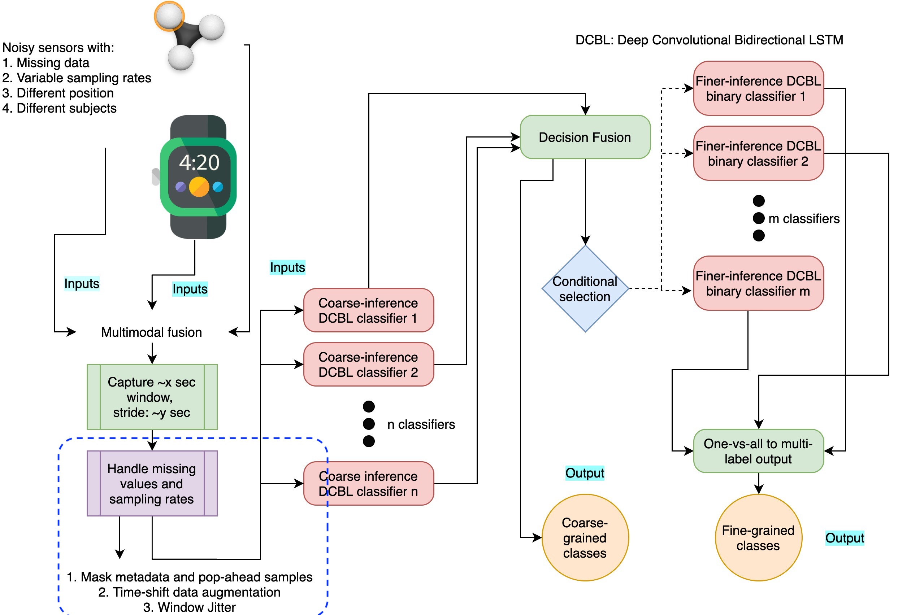

# Deep Convolutional Bidirectional LSTM for Complex Activity Recognition with Missing Data

This repo contains sample code for training deep learning pipelines on multimodal data containing missing and misaligned samples, noisy artifacts and data with variable sampling rates, intended for complex event processing. We have benchmarked the pipeline on complex activity recognition using the Cooking Activity Recognition Dataset. [**[Paper](https://www.researchgate.net/publication/341055525_Deep_Convolutional_Bidirectional_LSTM_for_Complex_Activity_Recognition_with_Missing_Data)**] [**[Slides](https://drive.google.com/file/d/1UDM38jvAkwiQRNNMcIAKhnV3b-qJigyF/view)**] [**[Presentation Video](https://www.youtube.com/watch?v=rAgnfvsDK-o)**]

The proposed training pipeline stood 3rd in the **[Cooking Activity Recognition Challenge](https://abc-research.github.io/cook2020/)** out of 78 teams.

## Summary
Complex activity recognition using multiple on-body sensors is challenging due to missing samples, misaligned data times tamps across sensors, and variations in sampling rates. In this paper, we introduce a robust training pipeline that handles sampling rate variability, missing data, and misaligned data time stamps using intelligent data augmentation techniques. Specifically, we use controlled jitter in window length and add artificial misalignments in data timestamps between sensors, along with masking representations of missing data. We evaluate our pipeline on the Cooking Activity Dataset with Macro and Micro Activities, benchmarking the performance of deep convolutional bidirectional long short-term memory (DCBL) classifier. In our evaluations, DCBL achieves test accuracies of 88% and 72%, respectively, for macro- and micro-activity classifications, exceeding performance over state-of-the-art vanilla activity classifiers.



## Data Details
For raw dataset usage guide for the data used for benchmarking, please visit the **[Cooking Activity Recognition Challenge](https://abc-research.github.io/cook2020/)** website.

## Code and Usage

1. **Requirements**: The Jupyter notebooks used to train the models require Keras with Tensorflow backend and Scikit-learn. The notebook with training process are provided. 
2. **Macro Classifier**: The notebooks training macro classifiers are *Macro_Activity_Masking_Classifier.ipynb* and *Macro_Activity_Without_Masking_Classifier.ipynb*. 
3. **Micro Classifier**: The notebooks training micro classifiers are *Micro_Activity_Masking_Classifier.ipynb* and *Micro_Activity_Without_Masking_Classifier.ipynb*. 
4. **Overall Pipelines**: The overall pipeline fusing macro and micro classifiers using weighted decision fusion is available with the name *Final_Pipeline.ipynb*. 
5. **Data and pre-trained checkpoints**: The data and pre-trained checkpoints of classifiers are available in the repo. The path used in *Final_Pipeline.ipynb* for the classifier is directed to the trained checkpoints.

## Citation

Please cite this as:

Saha S.S., Sandha S.S., Srivastava M. (2021) Deep Convolutional Bidirectional LSTM for Complex Activity Recognition with Missing Data. In: Ahad M.A.R., Lago P., Inoue S. (eds) Human Activity Recognition Challenge. Smart Innovation, Systems and Technologies, vol 199. Springer, Singapore. https://doi.org/10.1007/978-981-15-8269-1_4

```
@Inbook{Saha2021,
author="Saha, Swapnil Sayan
and Sandha, Sandeep Singh
and Srivastava, Mani",
editor="Ahad, Md Atiqur Rahman
and Lago, Paula
and Inoue, Sozo",
title="Deep Convolutional Bidirectional LSTM for Complex Activity Recognition with Missing Data",
bookTitle="Human Activity Recognition Challenge",
year="2021",
publisher="Springer Singapore",
address="Singapore",
pages="39--53",
isbn="978-981-15-8269-1",
doi="10.1007/978-981-15-8269-1_4",
url="https://doi.org/10.1007/978-981-15-8269-1_4"
}
```
